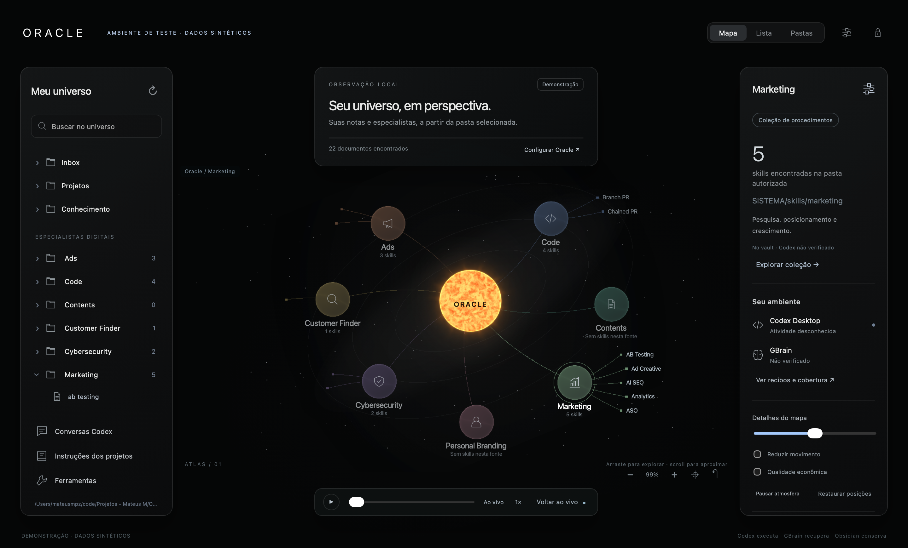

# Oracle

Aplicativo nativo para macOS que apresenta conhecimento do Obsidian, memória do GBrain e atividade observável do Codex Desktop.

**Codex executa. GBrain recupera. Obsidian conserva. Oracle apresenta.**

O frontend já funciona no app macOS: atlas completo em Three.js, núcleo solar procedural, sete coleções de especialistas, zoom ancorado, arraste com posições persistidas, inspetor, leitura de Markdown e editor de versões pessoais com diff. A integração e o instalador estão em validação; presença de pacote não é prova de agente ativo.



## Executar

Requisitos de desenvolvimento: macOS, ferramentas Swift da Apple, Bun e Python 3.

```sh
bun install --frozen-lockfile
bash scripts/bootstrap.sh
bash scripts/build.sh
open dist/Oracle.app
```

O build produz um aplicativo macOS com recursos locais. Não é um site hospedado. O pacote de desenvolvimento usa assinatura ad hoc; assinatura Developer ID e notarização ainda não foram concluídas.

Para um preview exclusivamente visual no navegador:

```sh
python3 -m http.server 4173 --bind 127.0.0.1 --directory Resources/web
```

O navegador usa dados de demonstração identificados. Acesso a arquivos, autenticação e integrações do sistema pertencem ao aplicativo nativo.

## O que está implementado

- Atlas com sete coleções: Ads, Code, Contents, Customer Finder, Cybersecurity, Marketing e Personal Branding.
- Sol, núcleos, ligações e atmosfera em Three.js/WebGL2; labels e controles acessíveis; fallback SVG.
- Mapa, Lista e Pastas; leitura do vault escolhido; fonte e hash do documento.
- Versões pessoais de SKILL.md com revisão de diferenças e detecção de mudança externa.
- Seletores nativos, menus, proteção de interface via LocalAuthentication e exportação de imagem.
- Journal de estrutura com aplicação, verificação, retomada e rollback preservador.
- GBrain oficial fixado no commit `2efaaf8f8a817b5b82e023383618fdcdb1cc5f7d`.
- Receptor de hooks com minimização de dados e sem inferir conclusão de objetivo a partir de Stop.
- Catálogo público fixado em versões, separado dos arquivos pessoais do vault.

## Fronteiras explícitas

A ponte não usa bancos privados do Codex, automação de cliques, tokens de assinatura ou outro motor de agentes. O fallback de configuração copia um pedido para execução no Codex Desktop. Hooks exigem confiança pelo mecanismo oficial. Conversas usam importação delimitada; o histórico completo ChatGPT/cloud não é presumido. O cartão Gmail não lê mensagens nem conecta uma conta.

O bloqueio protege a interface, não criptografa o vault. As capturas e testes publicados usam dados sintéticos. Dados locais de execução, vaults, credenciais e o pacote histórico pessoal de planejamento não fazem parte deste repositório.

## Evidências e componentes

- `docs/evidence/frontend-validation.md`: cenários observados no aplicativo nativo.
- `docs/benchmarks/`: amostras de renderização e processos, com limites de interpretação.
- `docs/decisions/atlas-renderer.md`: decisão do renderer e fontes primárias.
- `Sources/Oracle/`: shell e operações nativas em Swift.
- `packages/atlas/`: renderer Three.js.
- `packages/gbrain-adapter/`: adaptação sobre a biblioteca oficial GBrain.
- `skills/oracle-setup/`: procedimento de instalação executado pelo Codex.

As dependências de terceiros conservam suas próprias licenças. A licença do código original do Oracle ainda não foi definida.
