# Oracle 0.2 — validação visual

Capturas do app macOS com perfis isolados. A amostra principal contém 940 skills públicas do catálogo, cinco notas sintéticas e uma versão pessoal criada pela UI. O perfil de memória usa documentos sintéticos do teste GBrain. Não são capturas de produção do vault pessoal.

Os bundles de QA derivam dos builds da versão 0.2, com o executável e os recursos do aplicativo. Nome/identificador e perfil de teste são próprios; o identificador de validação fixa o perfil para impedir que um relançamento sem argumentos consulte a instalação pessoal. O arquivo do produto não contém esse perfil.

## Universo ao vivo

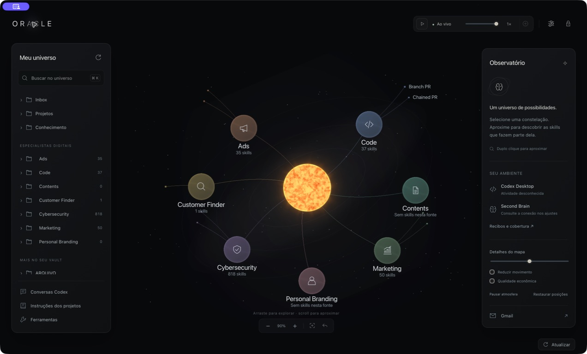

## Busca e leitura

A busca encontrou `ads-google` original no catálogo instalado. Enter abriu a fonte com SHA-256 `1319cc053cbcf9c34ec6fd86fe6c4edc69c8b6bc53cb9c733a00f1ee642d85d1`.

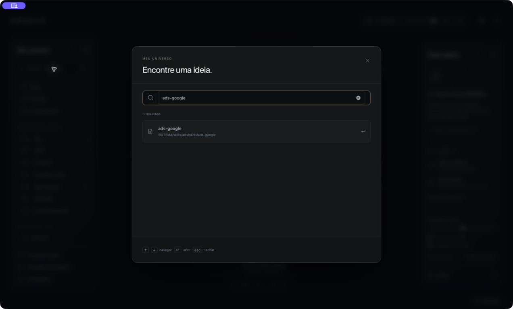

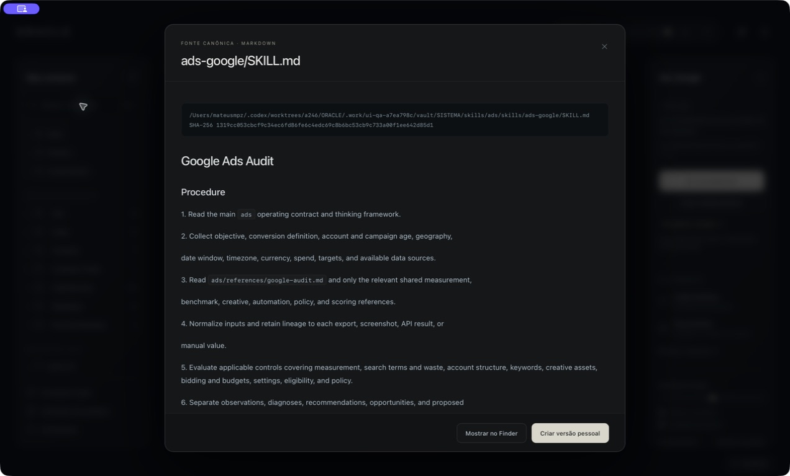

## Editor e diff

Escape com alterações não salvas preservou o rascunho. Voltar do diff preservou o texto. A gravação nativa criou uma versão pessoal e manteve a fonte byte a byte. Recibo: [native-editor-v2.json](native-editor-v2.json).

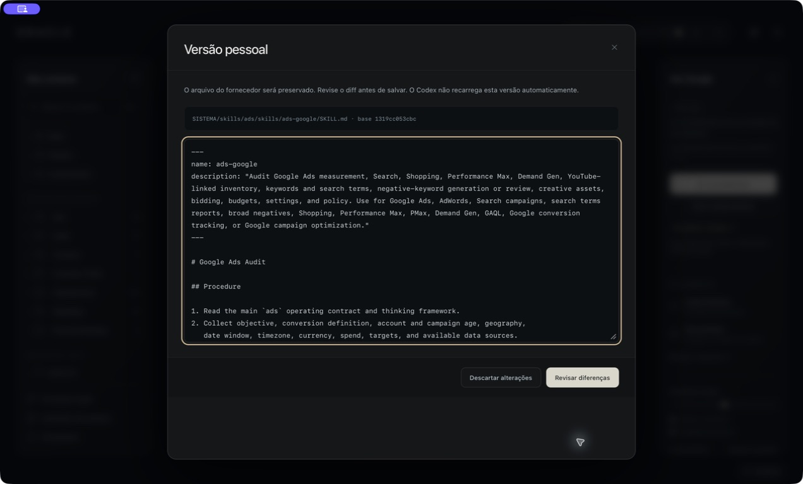

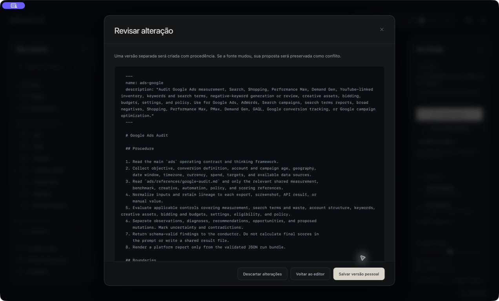

## Ajustes, formulários e tooltips

Cabeçalho e rodapé ficam visíveis enquanto o corpo rola. Tab alcança o fechamento e expõe o tooltip; Escape retorna ao controle de origem. Campos obrigatórios foram verificados antes de avançar.

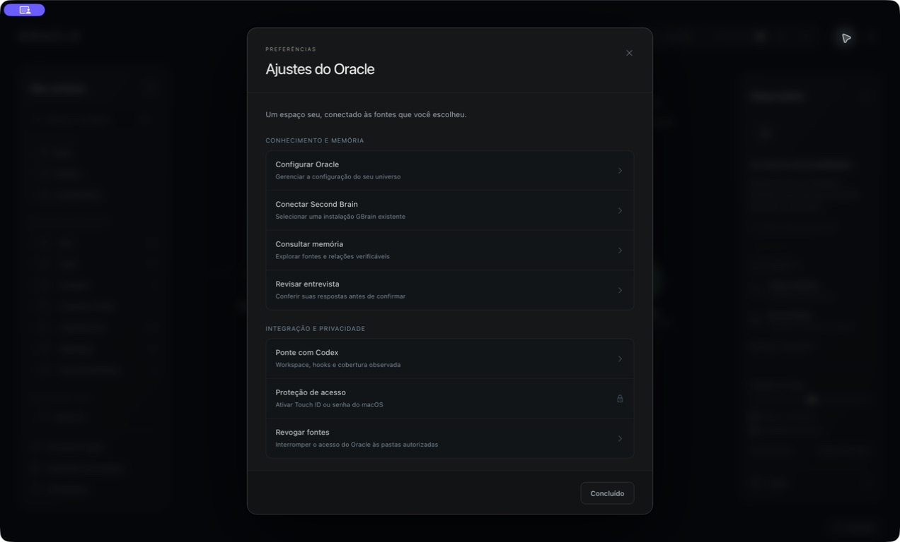

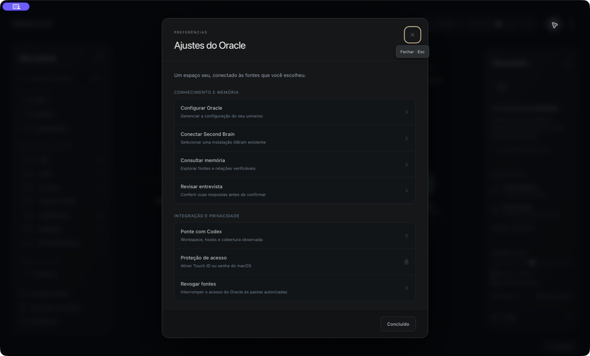

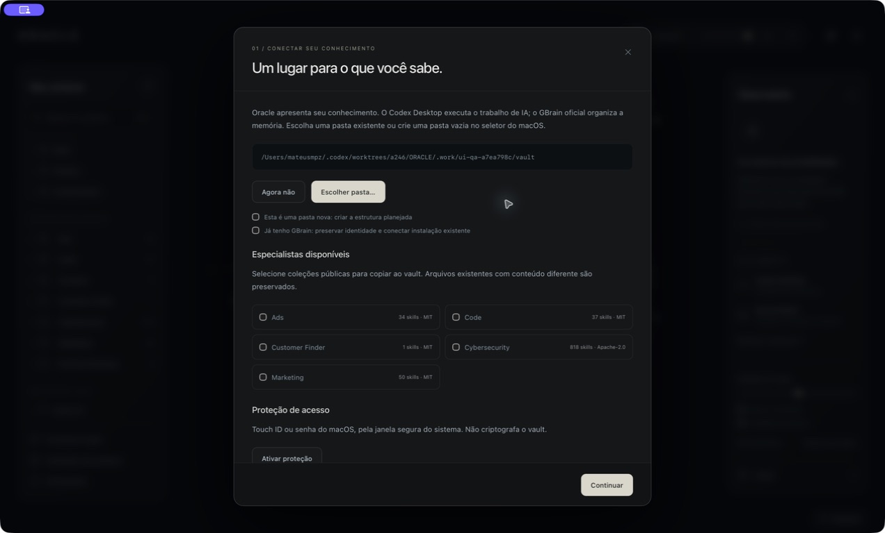

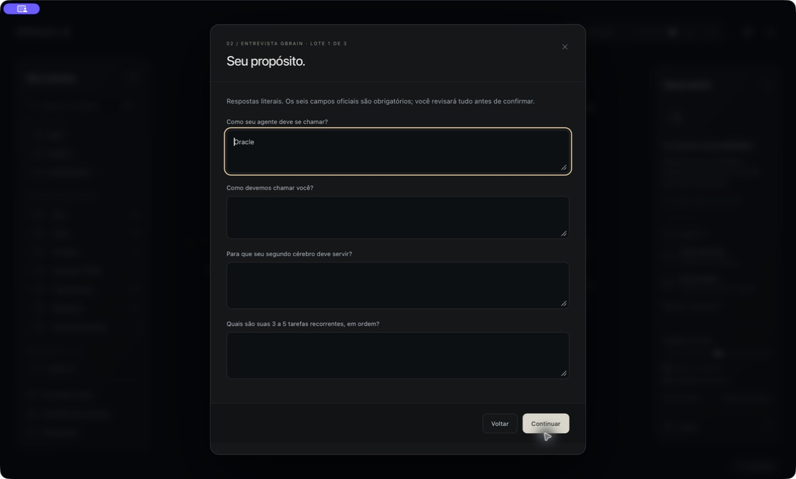

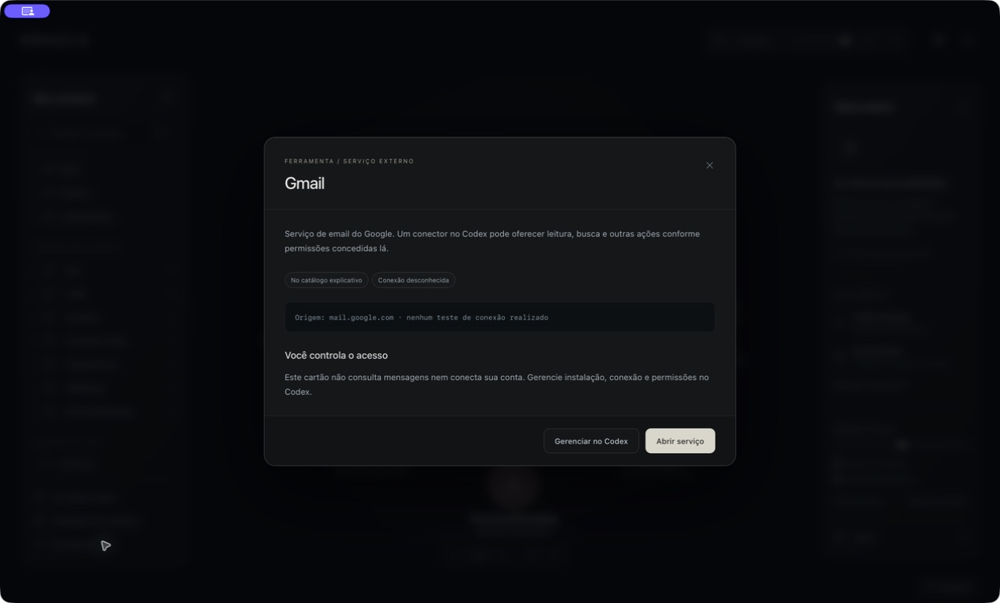

Conversas e instruções também foram abertas no app, com seus estados vazios e ações de importação/autorização acessíveis. Nenhuma conta ou projeto privado foi conectado nesses testes.

## Progresso real

O indicador acessível mostrou **2.000 de 4.902 arquivos verificados**, com a barra fina no topo e sem card flutuante. A instalação terminou com 4.902 arquivos verificados. [Recibos correspondentes](native-catalog-progress.json).

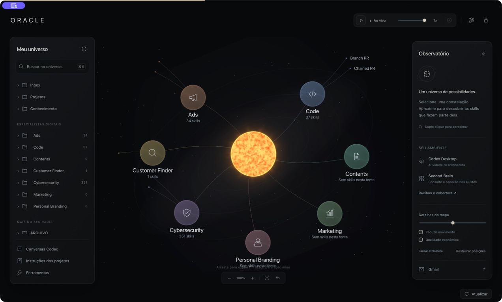

## Formação visual

O cursor nativo foi posicionado com as setas do teclado. Etapa 0: núcleo. Etapa 7: sete especialistas, ainda sem folhas. Etapa 14: skills e conexões. Voltar ao vivo restaura a fonte atual. A projeção pura foi testada em 15 posições; o percurso nativo preservou 4.909 arquivos e a configuração. [Contrato](timelapse-contract.json), [verificação dos arquivos](native-timelapse-files.json).

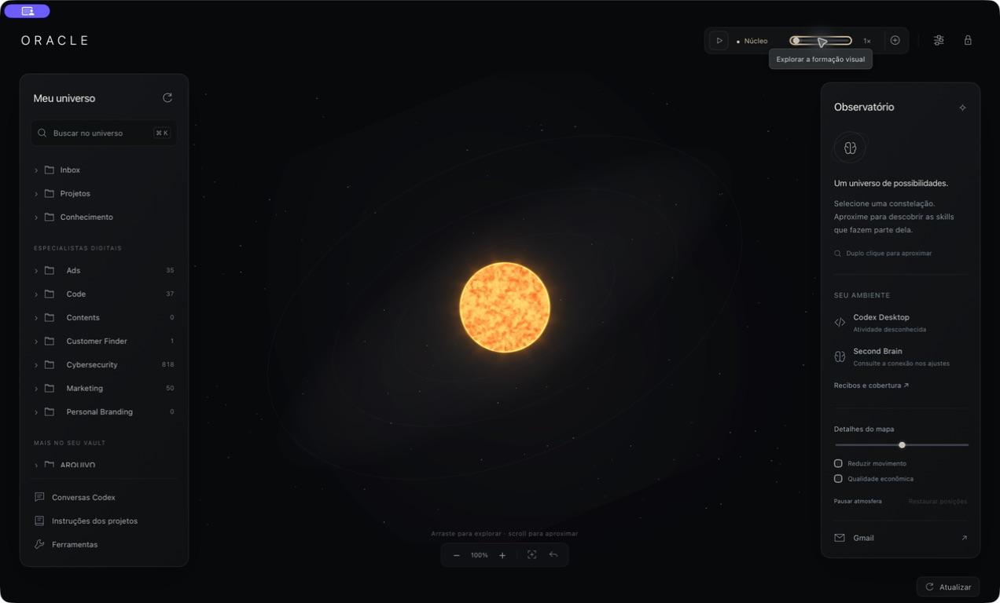

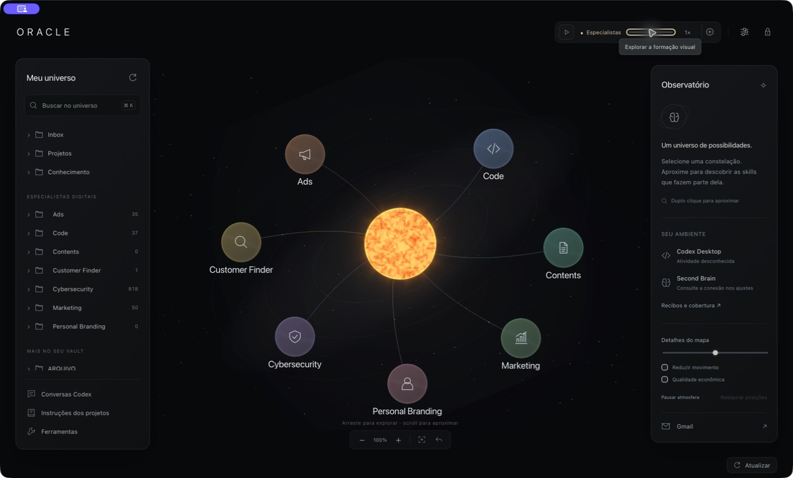

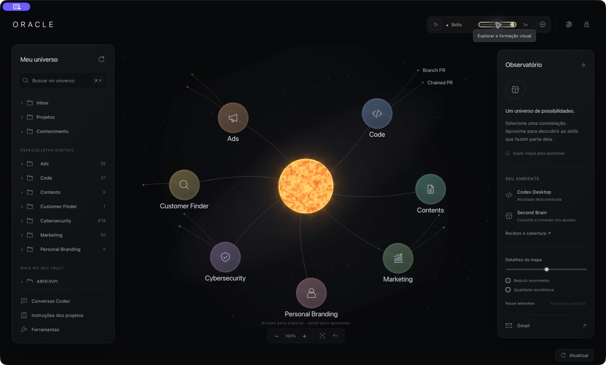

## Atualização

Clique nativo iniciou consulta real ao GitHub. GBrain integrado em dia; Cognee não adotado; fonte futura de skills explicitamente não configurada. As transações e o rollback têm [27 contratos verificados](update-contract.json). Não existia uma versão mais nova aprovada: o teste real do motor fez ativação/recuperação de slot usando o release oficial atual, sem alegar uma migração de versão ou de banco.

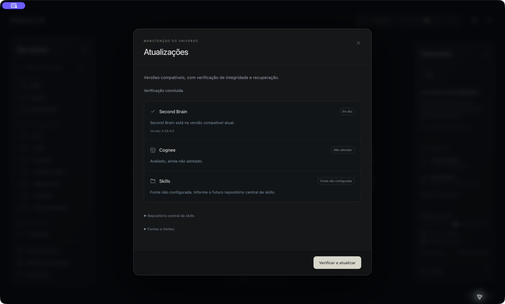

## Janela mínima e limites

O preview foi conferido a 1000 × 700, a dimensão mínima nativa: rodapé dentro da janela e corpo dos ajustes rolável. Busca, leitura, edição, retorno de foco, estado vazio e timelapse foram também exercitados no navegador. Isto complementa, não substitui, as capturas nativas acima.

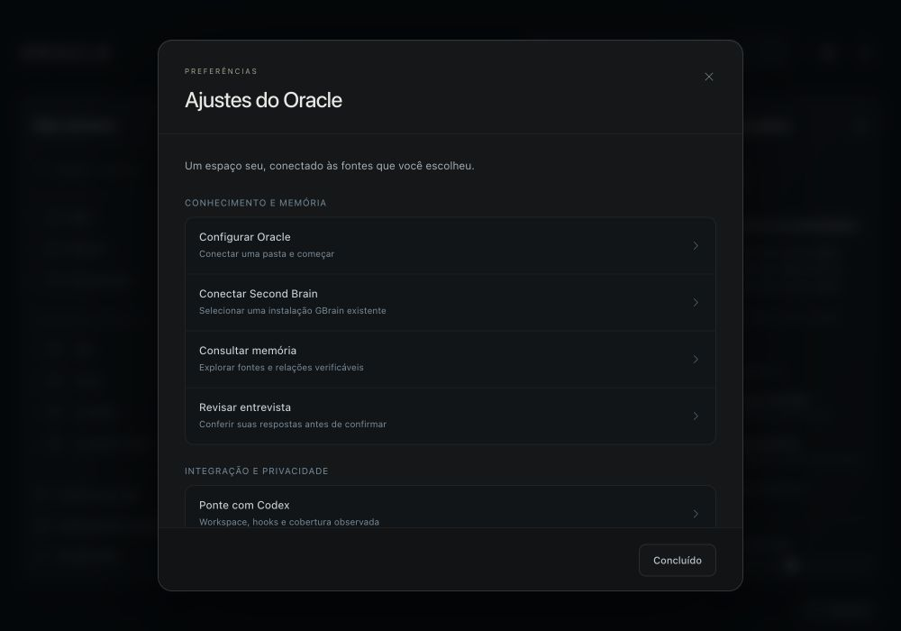

Não foi conduzida uma sessão completa de VoiceOver, um ensaio de trackpad físico ou uma instalação em outro Mac limpo. A assinatura continua ad hoc, sem notarização. Movimento ambiental e “Ao vivo” descrevem a visualização; não comprovam execução de um agente.

## Busca na memória

O frontend descarta respostas antigas quando a fonte ou a janela muda, limpa resultados anteriores durante a consulta e mantém a fonte capturada no link de abertura. A regressão foi exercitada com respostas sintéticas de 1.200 ms e 50 ms: a resposta lenta não substituiu a fonte rápida; a abertura conservou o escopo correto. [Recibo](memory-source-race.json).

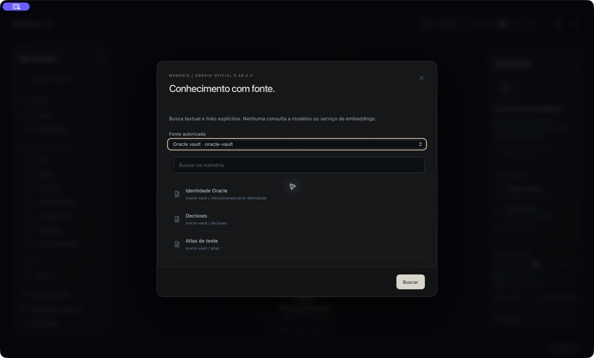
