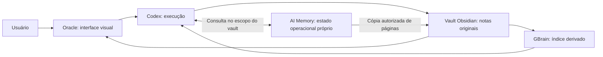

# Oracle, Codex e Obsidian

Guia do funcionamento e da validação do produto, atualizado em 30/09/2026. A implementação mantém a gestão de memória no backend. Não existe novo painel de memória nem tela do AI Memory nas configurações do Oracle.

## O papel de cada aplicativo

O Obsidian guarda o conhecimento em arquivos Markdown no vault escolhido. O Oracle oferece a navegação visual, os prompts, os tutoriais, as notas e o processo de configuração. O Codex executa os pedidos, lê as skills necessárias e produz os resultados. O GBrain mantém um índice derivado das notas para consulta.

O índice pode ser reconstruído. O conhecimento que precisa continuar disponível ao trocar de ferramenta deve permanecer em notas do vault. Nos novos planos de onboarding, o AI Memory é preparado junto com o Second Brain e recebe conexão Codex vinculada ao vault. Sua wiki e seu banco continuam em estado operacional próprio fora do vault. Instalar e conectar o serviço não copia automaticamente todas as conversas para o Obsidian.

## Jornada do usuário

1. Instalar o Obsidian e criar ou escolher um vault.
2. Abrir o Oracle, ativar a chave e selecionar a pasta original desse vault.
3. Instalar o Second Brain e o acervo conforme o plano local. Novos planos incluem também o runtime AI Memory e seu serviço compartilhado. A instalação só conclui depois das verificações de arquivos, índice, serviço e configuração exigidas. Conta e escolha de modelo não são pré-requisitos para instalar os componentes locais.
4. Abrir o espaço Oracle no Codex quando quiser executar tarefas. O aplicativo e os recursos precisam estar em caminhos duráveis. A confiança dos hooks continua sendo uma ação própria do Codex.
5. Abrir Knowledge Base no Oracle para preencher os roteiros pessoal e profissional. O prompt especifica o vault selecionado, as perguntas, os destinos e o recibo de conclusão.
6. Responder às perguntas no Codex, revisar os fatos e autorizar o salvamento. Copiar um prompt não prova que ele foi enviado ou executado.
7. Voltar ao Oracle e conferir o resultado da entrevista. O resultado distingue arquivos presentes, fatos aprovados cobertos e índice completo. Em caso de pendência, mostra o que falta para concluir.

## Como conferir o salvamento

O comprovante da entrevista vincula o preenchimento a um identificador, ao tópico e ao vault atual. Ele confere os caminhos permitidos, os bytes das notas e a cobertura dos fatos aprovados. O comprovante do índice usa o hash e a geração da mesma leitura do manifesto e mantém o resultado pendente se houver uma atualização concorrente ou um checkpoint ativo.

Existem quatro provas diferentes: o arquivo foi gravado; os fatos aprovados estão cobertos; o índice foi atualizado; uma consulta do Codex recuperou o conteúdo. Uma dessas provas não substitui as demais. Uma pasta vazia ou uma antiga conversa não confirma que uma nova resposta chegou.

## Skills no Codex

O usuário pode pedir, por exemplo, `/oracle Quero organizar a criação de conteúdo para meu Instagram`. O roteador pesquisa o acervo real, distingue skills de prompts e tutoriais, escolhe uma combinação pequena e lê as instruções necessárias antes de executar.

O recibo deve separar a descoberta em disco, a disponibilidade na sessão, as instruções realmente lidas e o resultado produzido. Ter um SKILL.md instalado não prova que seu método foi aplicado. Os testes de pesquisa incluem conteúdo para Instagram, oferta e implementação de API; não constituem uma garantia para qualquer pedido possível.

## Memória no backend

A instalação verifica o artefato oficial AI Memory v2.4.2 pelos hashes fixados, inicia o perfil separado e prepara um único serviço HTTP local para as conversas Codex. O workspace recebe a conexão MCP e instruções para consultar histórico relevante usando os valores exatos de project e workspace, sem inferência adicional de modelo. Uma integração global compatível v2.4.1 ou v2.4.2 é preservada, sem duplicata ou alteração do Hermes. Planos anteriores não são migrados silenciosamente.

A captura Oracle atual abrange prompts e últimas respostas no seu próprio espaço do Codex, quando autorizada. Ela não lê automaticamente todos os projetos e conversas do Codex. A rotina local pode continuar funcionando mesmo quando os hooks apontam para um executável ausente, por isso o backend agora verifica também os caminhos e a autoria dos recursos.

A ponte opcional do AI Memory é unidirecional: lê páginas elegíveis de um projeto autorizado e escreve em `INBOX/oracle-ai-memory` no vault selecionado. Mantém identidade, origem, versão e hash. As páginas e o snapshot precisam ser especificados antes da cópia. Resumos de sessões exigem escopo próprio; registros brutos, logs e bancos não são copiados como conhecimento por padrão.

Uma nota humana divergente é preservada como conflito. Se uma entrega for interrompida, o backend permite conferir a pendência e preservar a edição local antes de liberar outras entregas. A mudança de vault invalida a autorização anterior. A existência dessas APIs não equivale a habilitação ou exportação no perfil pessoal.

As rotinas internas de exportação e backup são acionáveis pelo Codex ou pelo operador através do comando nativo `--memory`. A instalação automática está incorporada aos novos planos. Captura, confiança de hooks, exportação para o vault e upload ao GitHub conservam autorizações próprias. A sincronização automática com GitHub e a exportação contínua de todas as memórias ainda não estão habilitadas nem homologadas. Elas precisam de destino privado e prova contra recaptura e duplicação.

## Backups e atualizações

O backup de notas, anexos e `.obsidian` fica separado do backup do banco de busca. A restauração de notas usa uma pasta nova e vazia; o vault atual é preservado. Os recibos indicam cobertura, integridade e exclusões. A cópia local não implica upload para o GitHub do usuário.

As atualizações de aplicativo, acervo e GBrain possuem origens e verificações próprias. Uma alteração no GitHub precisa gerar a publicação correspondente para aparecer como uma versão instalável. O monitor de atualização conserva o aplicativo anterior até confirmar que a interface e o estado local essencial iniciaram; o encerramento sem confirmação pode disparar recuperação.

## Distribuição e suporte

A integração utiliza caminhos duráveis do aplicativo instalado. Se os hooks de uma instalação anterior referirem a um bundle temporário ausente, a ponte precisa ser preparada novamente e sua confiança conferida no Codex. A verificação não fabrica captura, execução ou fatos aprovados.

O canal de desenvolvimento é ad hoc e não notarizado. A publicação de um ZIP estável para o atualizador é distinta da homologação Apple. Consulte [distribuição developer](developer-update-distribution-20260930.md) para as verificações e limites. O alvo nativo continua Apple Silicon, macOS 13+. Uma versão do plugin foi apenas pesquisada, sem implementação.

## Comprovação desta implementação

O build developer final passou em 124 verificações da jornada real Core em perfil isolado. O teste preparou AI Memory v2.4.2 e um serviço HTTP compartilhado, conferiu dois clientes MCP, configuração e instruções do Codex, reabertura, troca/retorno de vault, interrupção e todas as fases do controller nativo. As 473 verificações focais do mesmo build e as 68 do protocolo Oracle offline passaram em seus próprios escopos.

A configuração Oracle MCP agora identifica vault e revisão. Uma conexão iniciada ou reiniciada com configuração antiga recusa o perfil trocado. Configurações legadas precisam ser repreparadas; edições humanas continuam preservadas. O gate valida a configuração recebida, sem inferir qual vault uma conversa antiga pretendia usar.

As contagens acima pertencem à validação funcional isolada de 30/09, antes da promoção de versão. O manifesto e o relatório do pacote publicado identificam o build entregável; não somam os testes como uma jornada universal. Capturas e logs detalhados ficam na evidência local do mantenedor.
